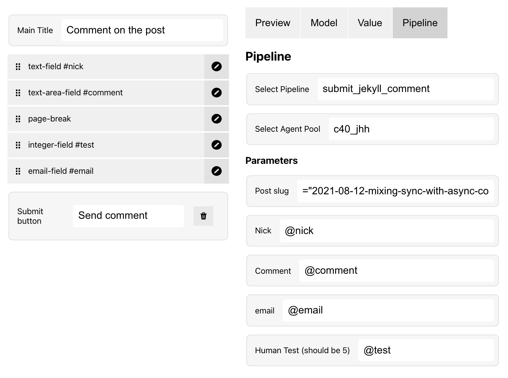

# Setting up a pipeline for the form

{ align=right }

The *Pipeline tab* defines how to handle the form input using our [Pipeline environment](../pipelines/index.md).

 1. Select which *Pipeline* you want to use
 2. Select which *Agent pool* to use
 3. Configure pipeline parameters (if the pipeline has any)

## Configuring pipeline parameters

From the *Parameters section* you can map how fields are connected to [pipeline model parameters](../pipelines/model/parameters.md). 

Field connections can be indicated as:

| The value            | Summary                                                  |
| -------------------- | -------------------------------------------------------- |
| `@`                  | All form fields mapped as a JSON object                  |
| `@my_password`       | Map to a field by keyword `my_password`                  |
| `@user.email`        | Map to a property `email` of the `user` object           |

Constant values can be indicated as a *JSON value* with a leading `=` character:

| The value            | Summary                                                  |
| -------------------- | -------------------------------------------------------- |
| `="The text"`        | String                                                   |
| `=false` or `=true`  | Boolean                                                  |
| `=123`               | Number                                                   |
| `={"foo":"bar"}`     | Object                                                   |
| `=["a", "b", "c"]`   | Array                                                    |
| `=null`              | Null                                                     |
