# Editing a form

From here you can set the title and add items to your form.

On the right side you can see the preview of how the form will look.

## Changing button labels

You can add items to the form by clicking the `+`-button next to the page title.

=== "Cancel button label"

    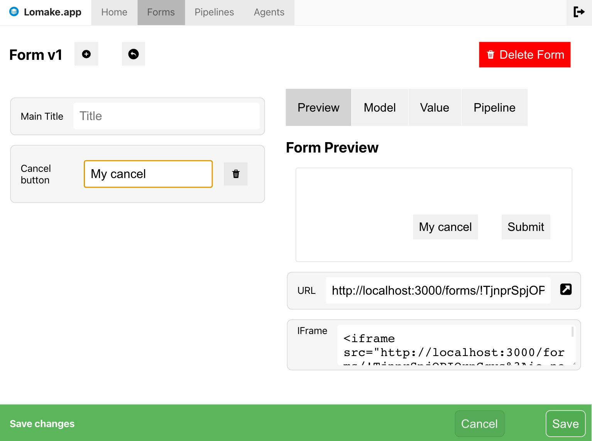{ align=right }

    1. Click the `+`-button
    2. Select the option `Cancel button label`
    3. Modify the label text
    4. Once you're happy with your changes, click `Save button` in the bottom panel to save 
       your changes to the backend

=== "Submit button label"

    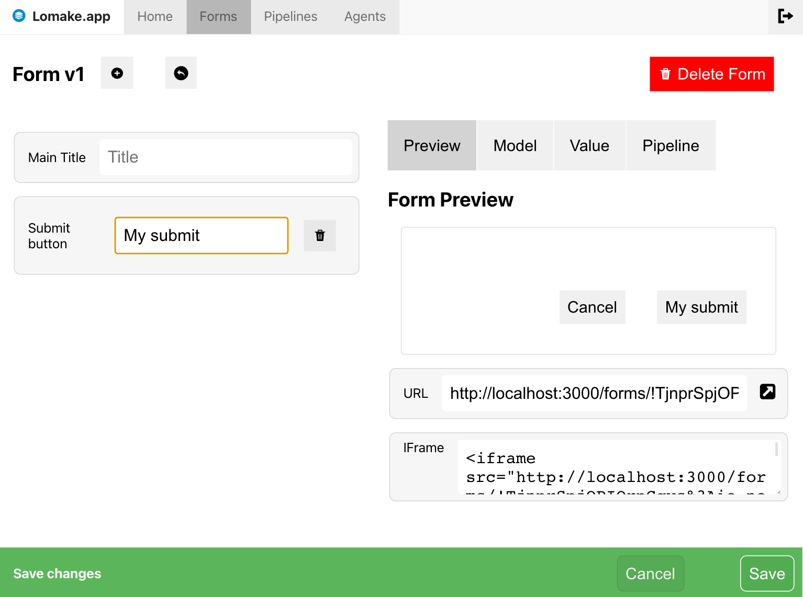{ align=right }

    1. Click the `+`-button
    2. Select the option `Submit button label`
    3. Modify the label text
    4. Once you're happy with your changes, click `Save button` in the bottom panel to save 
       your changes to the backend

=== "Next page button label"

    { align=right }

    1. Click the `+`-button
    2. Select option `Page break`
    3. Click the edit icon next on the `page-break` item
    4. Click the `+`-button on the Page break edit modal and select the `Next button label` option
    5. Modify the label text
    6. Close the modal
    4. Once you're happy with your changes, click `Save button` in the bottom panel to save 
       your changes to the backend

=== "Back button label"

    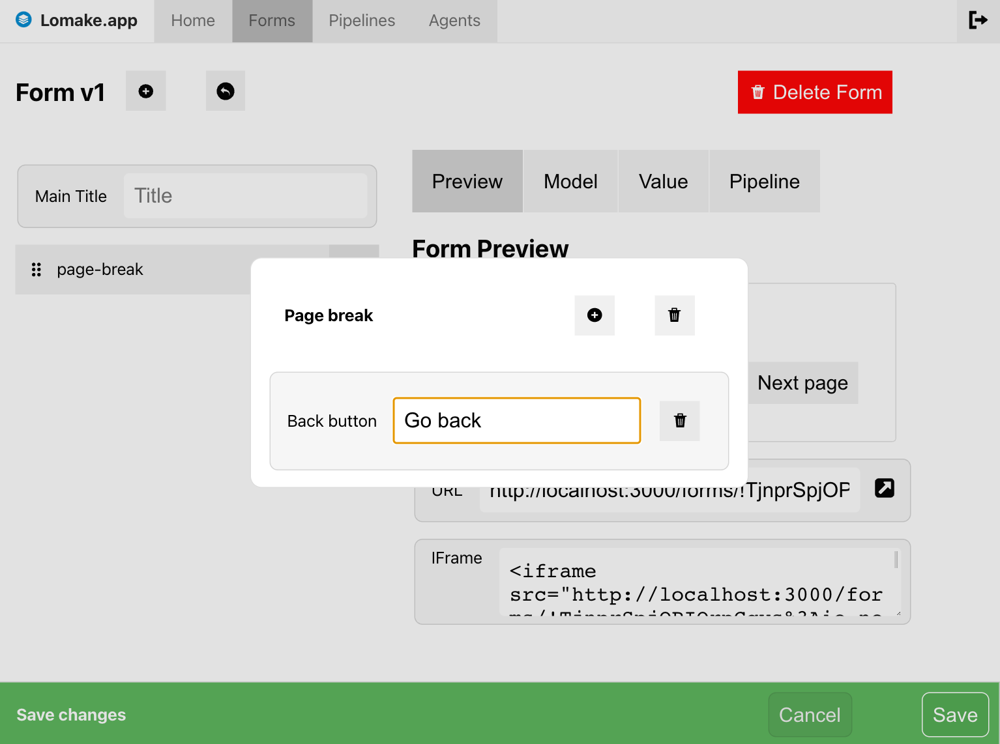{ align=right }

    1. Click the `+`-button
    2. Select option `Page break`
    3. Click the edit icon next to the `page-break` item
    4. Click `+`-button on the Page break edit modal and select the `Back button label` option
    5. Modify the label text
    6. Close the modal
    4. Once you're happy with your changes, click `Save button` in the bottom panel to save 
       your changes to the backend

## Adding text field

=== "Preview view"

    { align=right }

    New *text field* can be added from the `+`-action menu next to the page title.

    This field is intended for a text content.

    You can see the preview on the right side of the editor.

=== "Modify the field"

    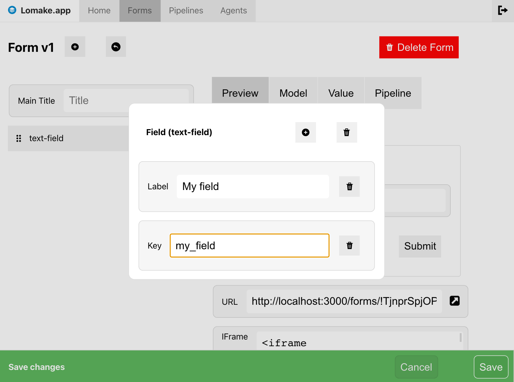{ align=right }

    1. Click the edit icon next to the field you want to edit
    2. If not already activated, you can add features from the `+`-action menu
    3. Modify the field
    4. Close the modal
    4. Once you're happy with your changes, click the `Save`-button in the bottom panel to save 
       your changes to the backend
    1. ...or cancel your changes using the `Cancel`-button

## Adding password field

=== "Preview view"

    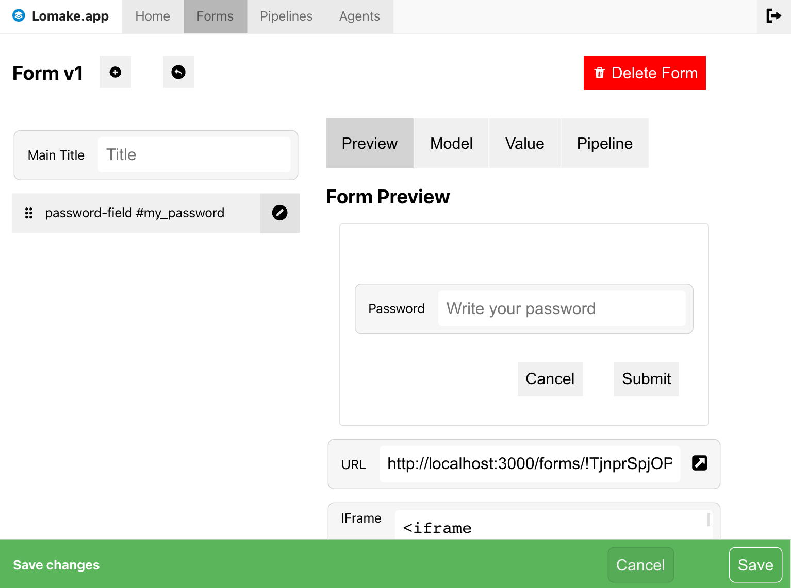{ align=right }

    New *password field* can be added using the `+`-button next to the page title.

    This field is intended for a secret text content.

    You can see the preview on the right side of the editor.

=== "Modify the field"

    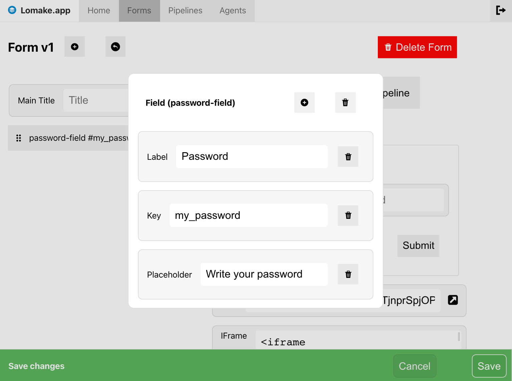{ align=right }

    1. Click the edit icon next to the field you want to edit
    2. If not already activated, you can add features from the `+`-action menu
    3. Modify the field
    4. Close the modal
    4. Once you're happy with your changes, click the `Save`-button in the bottom panel to save 
       your changes to the backend
    1. ...or cancel your changes using the `Cancel`-button

## Adding email field

=== "Preview view"

    { align=right }

    New *email field* can be added using the `+`-button next to the page title.

    This field is intended for a email addresses.

    You can see the preview on the right side of the editor.

=== "Modify the field"

    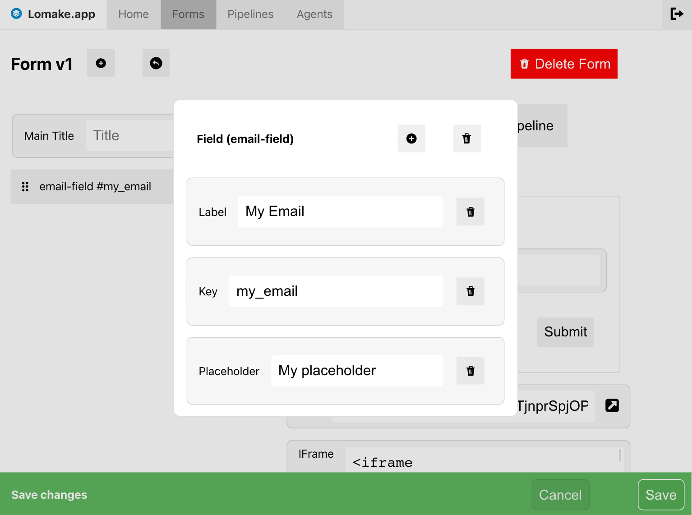{ align=right }

    1. Click the edit icon next to the field you want to edit
    2. If not already activated, you can add features from the `+`-action menu
    3. Modify the field
    4. Close the modal
    4. Once you're happy with your changes, click the `Save`-button in the bottom panel to save 
       your changes to the backend
    1. ...or cancel your changes using the `Cancel`-button

## Adding text area field

=== "Preview view"

    { align=right }

    New *text area field* can be added using the `+`-button next to the page title.

    This field is intended for a multi line content.

    You can see the preview on the right side of the editor.

=== "Modify the field"

    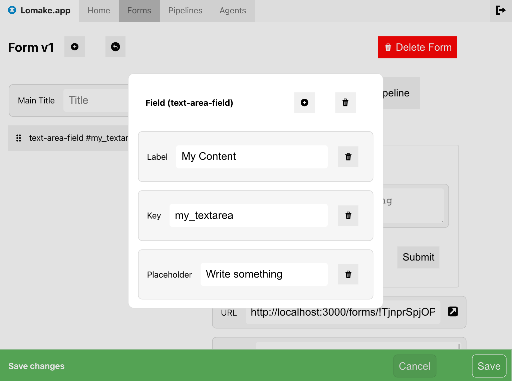{ align=right }

    1. Click the edit icon next to the field you want to edit
    2. If not already activated, you can add features from the `+`-action menu
    3. Modify the field
    4. Close the modal
    4. Once you're happy with your changes, click the `Save`-button in the bottom panel to save 
       your changes to the backend
    1. ...or cancel your changes using the `Cancel`-button

## Adding integer field

=== "Preview view"

    { align=right }

    New *integer field* can be added using the `+`-button next to the page title.

    This field is intended for integer numbers.

    You can see the preview on the right side of the editor.

=== "Modify the field"

    { align=right }

    1. Click the edit icon next to the field you want to edit
    2. If not already activated, you can add features from the `+`-action menu
    3. Modify the field
    4. Close the modal
    4. Once you're happy with your changes, click the `Save`-button in the bottom panel to save 
       your changes to the backend
    1. ...or cancel your changes using the `Cancel`-button

## Adding checkbox field

=== "Preview view"

    { align=right }

    New *checkbox field* can be added using the `+`-button next to the page title.

    This field is intended for boolean values.

    You can see the preview on the right side of the editor.

=== "Modify the field"

    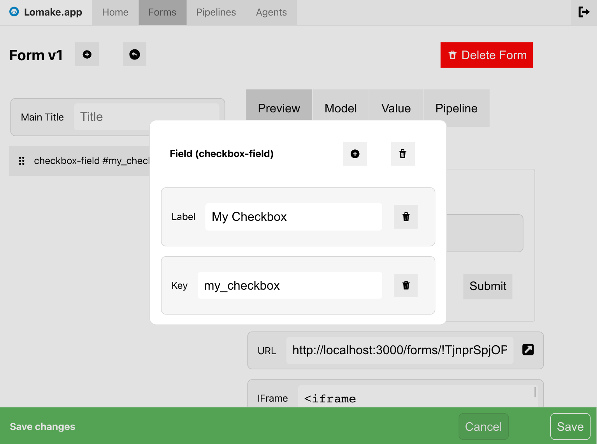{ align=right }

    1. Click the edit icon next to the field you want to edit
    2. If not already activated, you can add features from the `+`-action menu
    3. Modify the field
    4. Close the modal
    4. Once you're happy with your changes, click the `Save`-button in the bottom panel to save 
       your changes to the backend
    1. ...or cancel your changes using the `Cancel`-button

## Adding select field

=== "Preview view"

    { align=right }

    New *select field* can be added using the `+`-button next to the page title.

    This field is intended for selecting from multiple options.

    You can see the preview on the right side of the editor.

=== "Modify the field"

    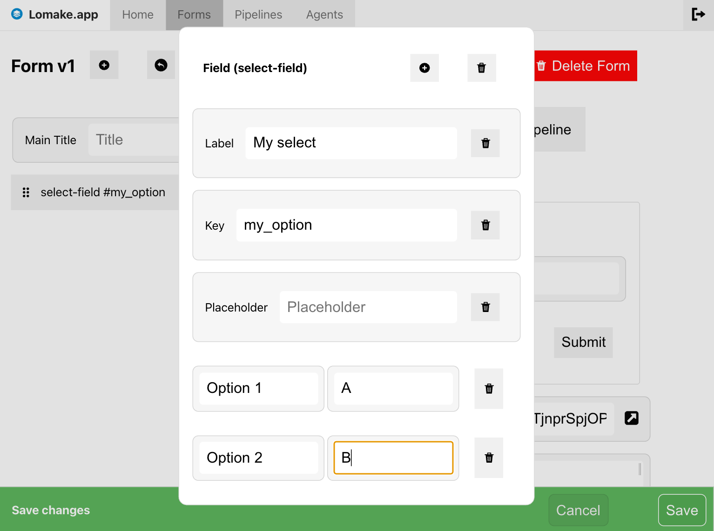{ align=right }

    1. Click the edit icon next to the field you want to edit
    2. If not already activated, you can add features from the `+`-action menu
    3. Modify the field
    4. Close the modal
    4. Once you're happy with your changes, click the `Save`-button in the bottom panel to save 
       your changes to the backend
    1. ...or cancel your changes using the `Cancel`-button

## Adding slider field

=== "Preview view"

    { align=right }

    New *slider field* can be added using the `+`-button next to the page title.

    This field is intended for selecting from multiple options.

    You can see the preview on the right side of the editor.

=== "Modify the field"

    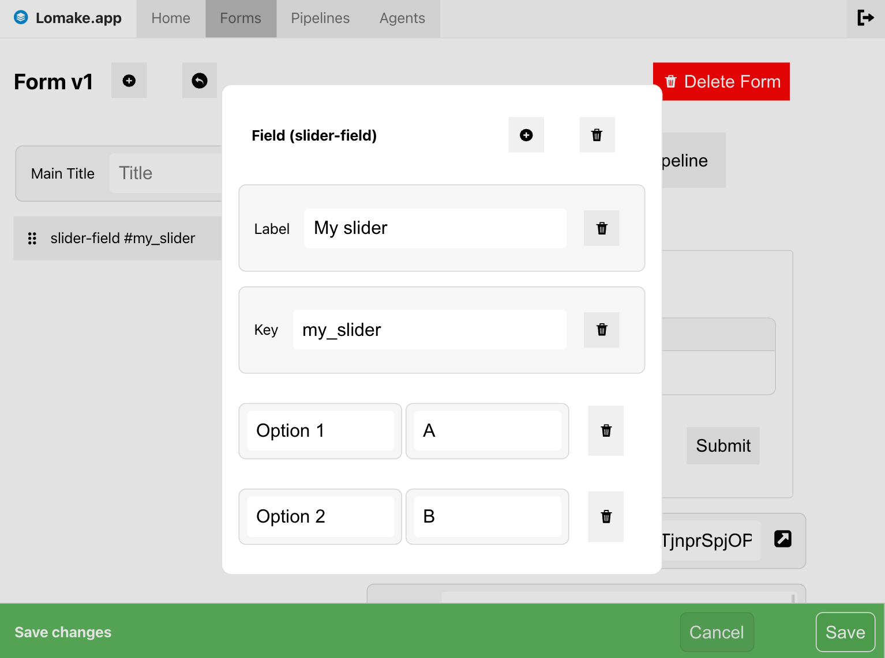{ align=right }

    1. Click the edit icon next to the field you want to edit
    2. If not already activated, you can add features from the `+`-action menu
    3. Modify the field
    4. Close the modal
    4. Once you're happy with your changes, click the `Save`-button in the bottom panel to save 
       your changes to the backend
    1. ...or cancel your changes using the `Cancel`-button

## Adding multiple pages

=== "Preview"

    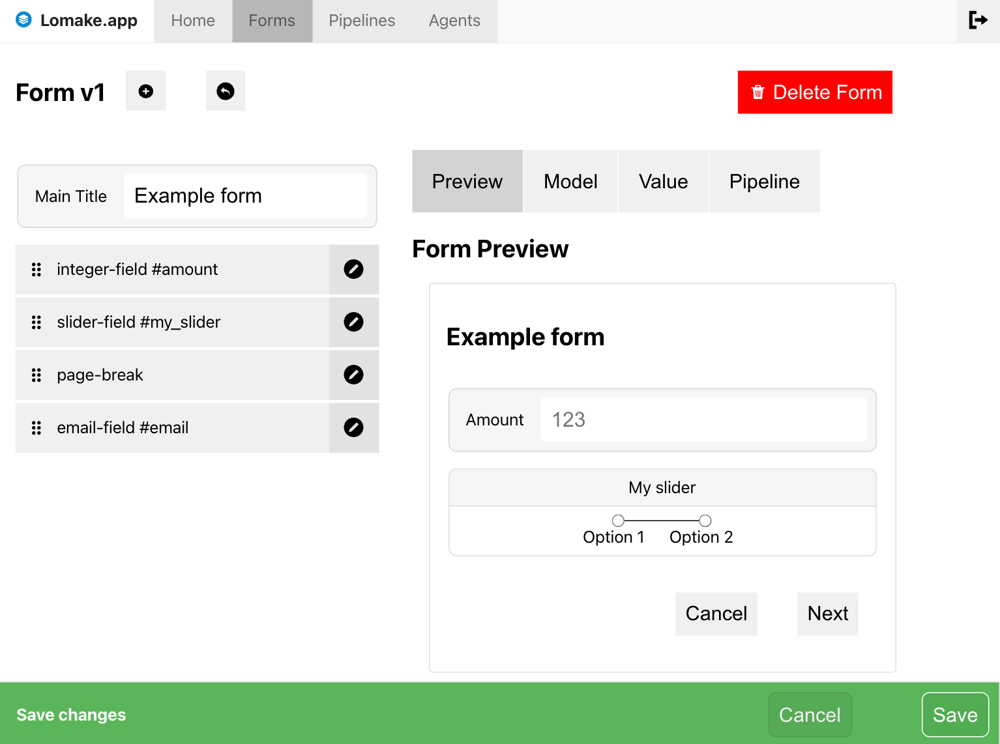{ align=right }

    The *page break* is intended to break the form into multiple pages.

    You can see the preview on the right side of the editor. 

    You can test other pages by clicking the form's `Next` and `Back`-buttons.

=== "Modify page button labels"

    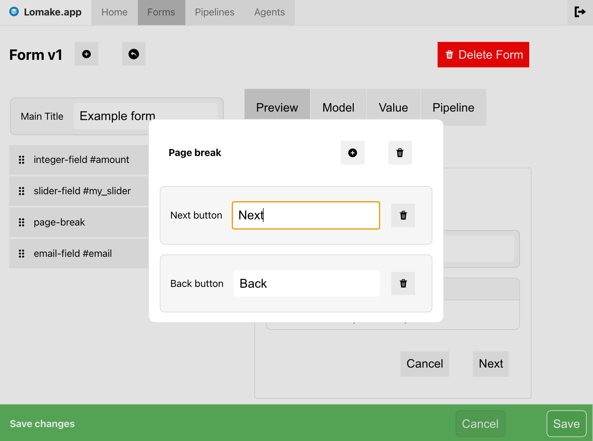{ align=right }

    1. Click the edit icon next to the page break you want to edit
    2. If not already activated, you can add features from the `+`-action menu
    3. Modify the labels
    4. Close the modal
    4. Once you're happy with your changes, click the `Save`-button in the bottom panel to save 
       your changes to the backend
    1. ...or cancel your changes using the `Cancel`-button
