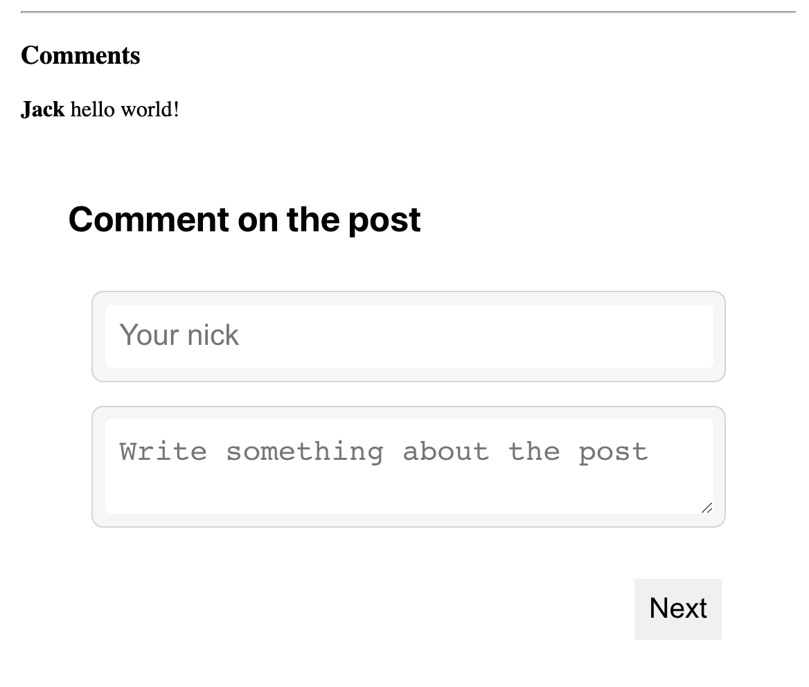

# Commenting on static website

{ align=right }

We embedded commenting on a static web page at [thejhh.me](https://thejhh.me/2021/08/12/mixing-sync-with-async-code.html).

The website is built using [Jekyll](https://jekyllrb.com/) and [Github Pages](https://pages.github.com/).

New comments are processed by our [Pipeline software](../../pipelines/index.md) with a 
[custom pipeline](https://github.com/sendanor/pipeline-runner/blob/main/examples/pipeline/submit-jekyll-comment.json) 
which adds the comment to our Jekyll's `_data` folder in Git repository.

*Note!* The comment will not be added on the page instantly because of a delay on the Github side. 
However, our agent will start processing the pipeline instantly.
