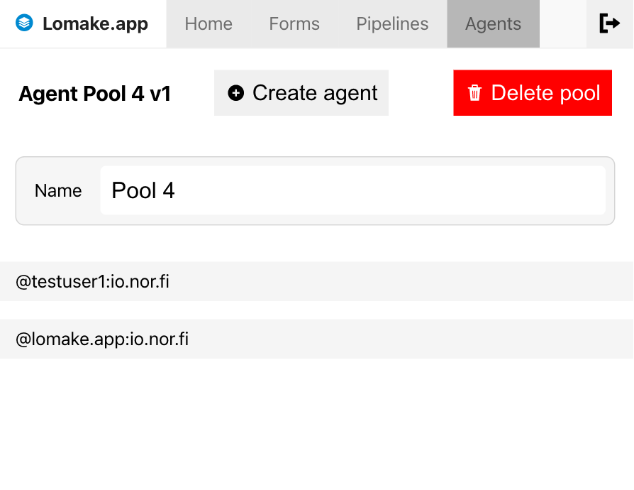

# Pipeline Agents and Pools

The *Pipeline Agent* is an instance of [the Pipeline Runner software](../runner/index.md) -- using a special 
service account -- to process work on demand.

As our commercial customer we can set up the agent environment for you.

### Setting up the Agent Pool

{ align=right }

Before you can set up an agent, you'll need to create at least one *Agent Pool*.

It is a room where agents can look up and wait for work to become available.

To create *Agent pool* you can click the *Create pool* button and a new pool is added to the list 
in a moment.

### Setting up the Agent

{ align=right }

From the *Agent View* new agents can be added to the pool.

When an agent is created, you will receive an *Access Token* from the UI. 

***This token is displayed only once and should be saved and kept secret***. You will need it later 
to configure [the Pipeline Runner](../runner/index.md).

From here you can also rename or delete the pool.

